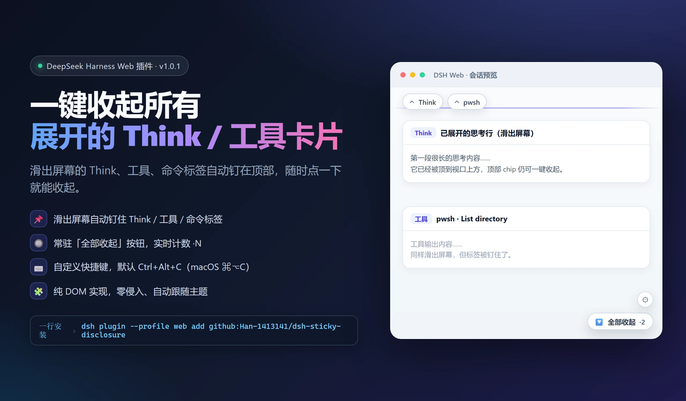
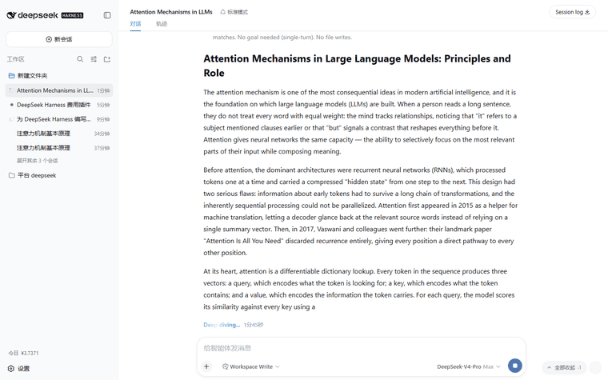
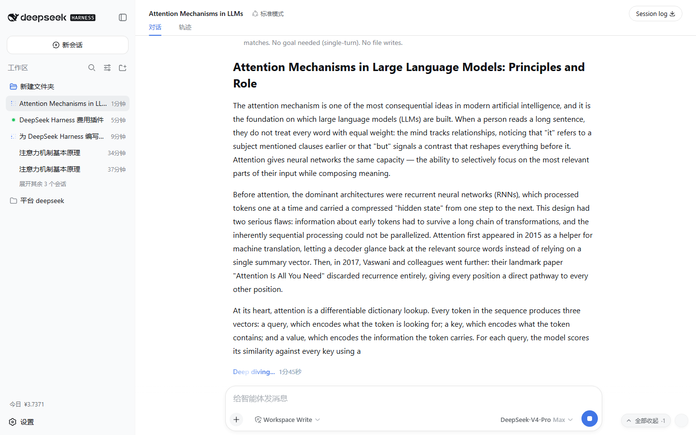
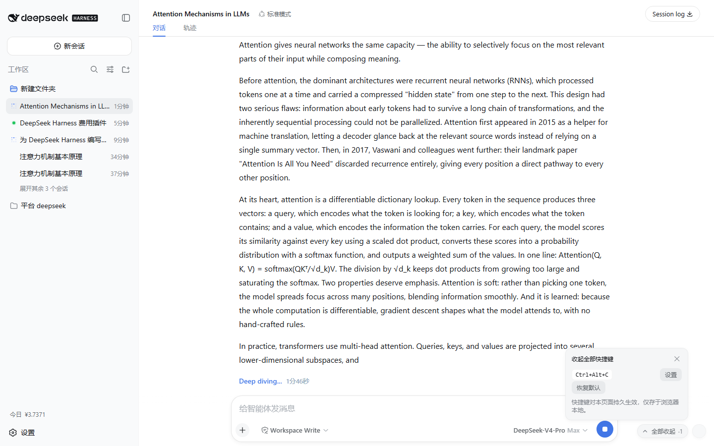
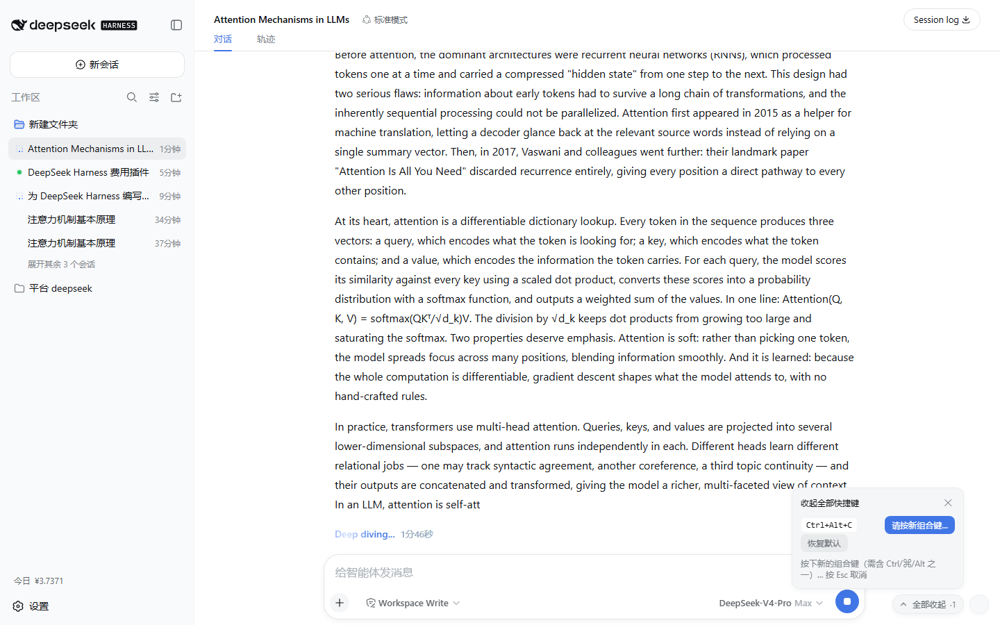
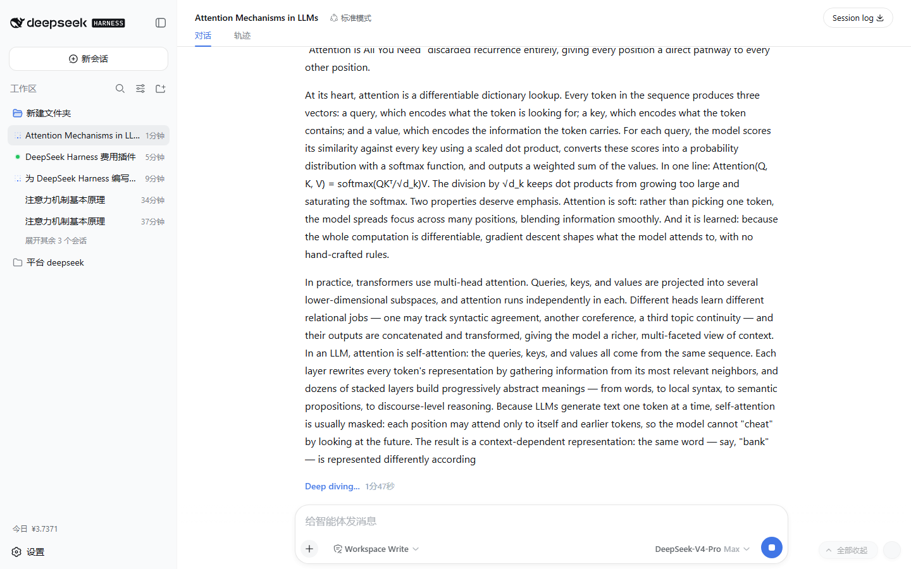

# dsh-sticky-disclosure

[](LICENSE)
[](https://github.com/Han-1413141/dsh-sticky-disclosure/actions/workflows/test.yml)
[](https://awesome-dsh-plugin.com)
English | [中文](README.md)



A DeepSeek Harness (DSH) Web client plugin: **collapse every expanded collapsible section in the conversation in one click** — `Think` reasoning rows, tool-call cards, command cards, context-injection rows, i.e. every `DisclosureRow` — via an always-visible pill with a live count and a **customizable hotkey**. When an expanded section scrolls off the top, its header is pinned to the top of the conversation so you can still collapse it.



## ✨ Features

| Feature | Description |
|---|---|
| 📌 Pin off-screen labels | Expanded Think / tool / command labels that slide off the top get pinned as chips; click a chip to collapse the original section |
| 🔘 Collapse-all pill | Always-visible pill at the bottom-right of the chat with a live count (`·N` = expanded sections); one click collapses them all |
| ⌨️ Customizable hotkey | Default `Ctrl+Alt+C` (macOS `⌘⌥C`); press the gear, press a new combo, done — persisted locally |
| 🎨 Native look | Styled entirely with the app's `--dsw-*` design tokens; follows dark/light themes |
| 🪶 Non-invasive | Pure DOM implementation — no app code touched; full cleanup on unload |

### Real screenshots (live DSH Web instance)

**Expanded Think row + the collapse-all pill with its live count**:



**Hotkey settings popover (gear → set → press the new combo)**:

　

**After one click — the count drops to zero**:



## Why

Long conversations accumulate expanded Think rows and tool cards, and collapsing them means hunting down each header one by one — often after it has already scrolled out of view. This plugin puts a permanent "collapse all" pill at the bottom-right of the chat — with a live count of how many sections are expanded — plus a customizable hotkey: **one click or one keystroke returns the conversation to its clean, collapsed view**. When a section scrolls off the top, its header is pinned at the top of the conversation so you never lose the collapse control.

## Behavior

- **Off-screen pinning**: once an expanded header fully slides past the top edge of the conversation scrollport, a chip appears at the top labelled with the section title (`Think`, tool name, …); clicking the chip collapses the original section, and the chip disappears when the header scrolls back into view or the section is collapsed.
- The **collapse-all pill** sits at the bottom-right of the conversation scrollport with a live count (`·N`); clicking it collapses **every** expanded disclosure in the conversation.
- The **hotkey** (default `Ctrl+Alt+C`, macOS `⌘⌥C`) does the same thing, so pressing it always has an immediately observable effect.
- Expand/collapse state, streaming output, and session switches are tracked via `MutationObserver` + scroll/resize listening so the count stays accurate; plugin disposal (HMR/stop) restores everything.
- On apply, the plugin logs `console.info("[dsh-sticky-disclosure] applied …")` and exposes `window.dshStickyDisclosure` (`expanded()` / `hotkey()` / `setHotkey(spec)`).

## ⌨️ Custom hotkey

1. Click the **keyboard gear** next to the collapse-all pill to open the settings popover;
2. Click **Set** — the popover enters capture mode;
3. **Press the new combo** (it must include `Ctrl` / `⌘` / `Alt`, e.g. `Ctrl+Shift+K`) — applied immediately and persisted in the browser's `localStorage` (nothing leaves your machine);
4. `Esc` cancels capture; **Reset default** restores `Ctrl+Alt+C`.

Programmatic access:

```js
window.dshStickyDisclosure.setHotkey({ ctrl: true, shift: true, code: "KeyK" }) // Ctrl+Shift+K
window.dshStickyDisclosure.hotkey()                                              // "Ctrl+Shift+K"
```

### Hotkey design

- Deliberately **not Escape**: the app's dialogs and popups already own `Escape` (the plugin only uses Esc to cancel its own capture, which never interferes);
- it **works while an input is focused** — the most common state, since focus usually stays in the composer;
- it backs off during IME composition (`isComposing`);
- it backs off on AltGr (`getModifierState("AltGraph")` — on some keyboard layouts AltGr is reported as Ctrl+Alt and must never intercept the characters it types).

### Stacking

- The collapse-all pill and the gear are fixed to the scrollport's bottom-right corner.
- `z-index: 15` (popover: 16): above chat content, below the app's overlay layer (20) and all dialogs/popups (100/1000-tier) — it never covers permission prompts, settings panels, or onboarding masks.
- Everything uses the app's design tokens (`--dsw-*`: background, border, shadow, type), so it follows dark/light themes and fonts automatically, with an entrance animation that respects `prefers-reduced-motion`.

## Install

> Requires: Node.js ≥ 20 + DeepSeek Harness (a version with the `dsh plugin` command; `npm install -g @deepseek-ai/dsh`). The plugin activates with `dsh web`.

### Option 0: one-click (recommended, no clone needed)

**PowerShell one-click script** (copy the whole line and paste; pnpm is provisioned automatically, git is auto-detected):

```powershell
irm https://raw.githubusercontent.com/Han-1413141/dsh-sticky-disclosure/main/install.ps1 | iex
```

**Or a plain command line** (machine must already have pnpm and git):

```bash
dsh plugin --profile web add github:Han-1413141/dsh-sticky-disclosure
```

Without git, use the GitHub archive tarball (update by remove-then-add):

```bash
dsh plugin --profile web add https://github.com/Han-1413141/dsh-sticky-disclosure/archive/refs/heads/main.tar.gz
```

### Option 1: local development (`dsh plugin` + symlink)

From this repository's **parent directory** (relative paths get anchored to the invoking directory):

```bash
git clone https://github.com/Han-1413141/dsh-sticky-disclosure.git
cd <parent of the clone>
# symlink; edit lib/client.js, refresh the page, done:
dsh plugin --profile web add link:./dsh-sticky-disclosure
# or a fixed install:
# dsh plugin --profile web add file:./dsh-sticky-disclosure
```

### Option 2: manual (no pnpm)

1. In `<DSH_HOME>\profiles\web\package.json` (default `%USERPROFILE%\.dsh\profiles\web\package.json`):
   - add `"dsh-sticky-disclosure": "link:<absolute path of this repo>"` to `dependencies`
   - append `"dsh-sticky-disclosure"` to `dsh.profile.bundles`
2. Create a directory junction in the profile's node_modules (the same shape a pnpm `link:` dependency leaves behind):
   ```powershell
   New-Item -ItemType Junction `
     -Path "$env:USERPROFILE\.dsh\profiles\web\node_modules\dsh-sticky-disclosure" `
     -Target "<absolute path of this repo>"
   ```

### Activate

Plugin-set changes take effect on **restart** (a running server keeps its old graph). **The bundle itself is served `no-cache`**: after editing `lib/client.js`, a page refresh (Ctrl+F5) is enough to pick up the new code — no server restart needed.

```bash
# after the initial install: stop the current dsh web, then start it again
dsh web
```

Verify it entered the plugin graph (expect `id: sticky-disclosure` and `name: dsh-sticky-disclosure`):

```bash
dsh --profile web --dump-config | findstr sticky-disclosure
```

On the page, the "collapse all" pill at the bottom-right of the chat area means the plugin is active.

### Update / Uninstall

```bash
dsh plugin --profile web update dsh-sticky-disclosure  # update to the latest commit (git form; or re-run the one-click script)
dsh plugin --profile web remove dsh-sticky-disclosure  # uninstall
```

Manual: remove the entries from `package.json` (`dependencies`/`bundles`) and delete the `profiles\web\node_modules\dsh-sticky-disclosure` junction, then restart `dsh web`.

## Tuning

All behavior parameters live in the constants block at the top of `lib/client.js`:

| Constant | Default | Meaning |
|---|---|---|
| `DEFAULT_HOTKEY` | `Ctrl+Alt+C` | Default hotkey (changeable in the settings popover, persisted) |
| `STORAGE_KEY` | `dsh-sticky-disclosure:hotkey` | localStorage key for the persisted hotkey spec |
| `DOCK_Z_INDEX` | `15` | Stacking level of the pill/gear (must stay below the app overlay layer at z-20) |
| `PANEL_Z_INDEX` | `16` | Settings popover level (above the pill, below app overlays) |
| `CONTROL_INSET` | `16` | Inset of the collapse-all pill from the scrollport's bottom-right corner |

## Tests

```bash
python test/verify.py   # needs Python 3 + playwright (python -m playwright install chromium)
```

`test/` contains:

- `mock.html` — a static harness reproducing the DSH DOM contract (`DisclosureRow` structure + the `[data-conversation-scroll]` scrollport);
- `verify.py` — a Playwright verification script (48 assertions);
- `capture.py` — a script that captures the demo screenshots/GIF against a live instance.

Coverage: pill presence and count, one-click collapse-all (visible sections and input-focused scenarios), **custom hotkey** (settings popover, capture, Esc cancel, persistence across reload, reset to default, invalid-spec rejection), automatic state sync, composer exclusion, and full disposal.

> CI (`.github/workflows/test.yml`) runs the same suite on every push.

## Limitations

- Scoped to the **conversation flow** (inside `[data-conversation-scroll]`). The Trajectory view has its own collapse controls and is out of scope.
- It works through the `data-open` / `data-disclosure-row` DOM contract. If the upstream app changes that internal structure across upgrades, the selectors need to follow — see `docs/ARCHITECTURE.md`.

## Repository layout

```
dsh-sticky-disclosure/
├── .github/workflows/
│   ├── test.yml                 # CI: Playwright verification suite
│   └── install-smoke.yml        # CI: one-click install smoke test (Windows + Linux)
├── install.ps1                  # one-click install/update script (irm … | iex)
├── package.json                 # dsh.client (platform: web) + dsh.bundle declaration
├── cordis.patch.yml             # host-tree entry row (bundle patch)
├── lib/
│   ├── index.js                 # host half: inert marker plugin (no behavior)
│   └── client.js                # browser half: self-contained bundle (__ModuleLoader__ handoff)
├── test/
│   ├── mock.html                # static harness reproducing the DSH DOM contract
│   ├── verify.py                # Playwright verification script (48 assertions)
│   └── capture.py               # demo asset capture script
├── docs/
│   ├── assets/                  # screenshots and GIF
│   └── ARCHITECTURE.md          # architecture and implementation details
├── README.md / README.en.md
└── LICENSE
```

## How it works

- Host side: `dsh-client-modules` scans Loader entries whose manifest declares `dsh.client.platform === "web"`, serves the built `exports["./client"]` artifact at `/plugins/<id>/client.js`, and injects the `window.__DSH_BOOT__` entry graph.
- Browser side: the bundle registers a module via `window.__ModuleLoader__.load({ id, factory })`, exports a cordis plugin (`name`/`apply`), and the Web shell's Loader activates it.
- The plugin body is pure DOM: it touches no app code — it reads the `data-open` / `data-disclosure-row` contract and dispatches clicks at the original headers, so it survives app upgrades, themes, and locales.

See [docs/ARCHITECTURE.md](docs/ARCHITECTURE.md) for the full pipeline, contracts, state model, hotkey configuration, and stacking design.

## License

[MIT](LICENSE)
