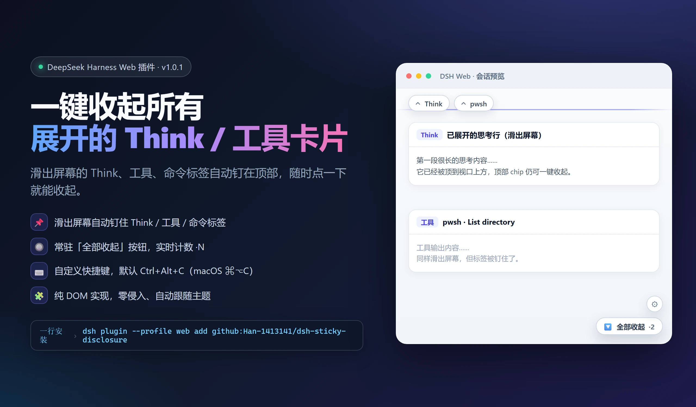
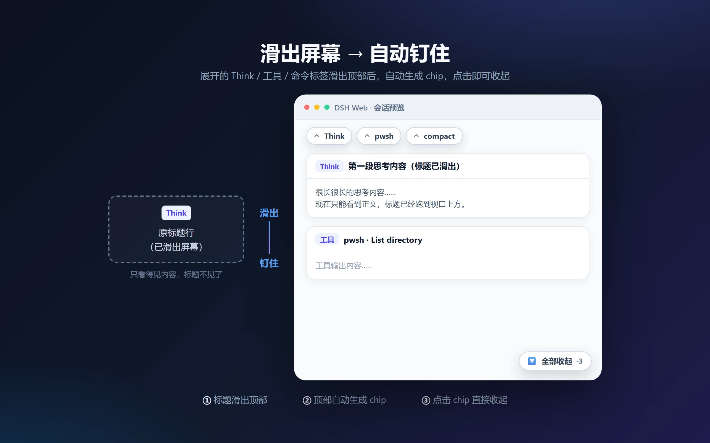
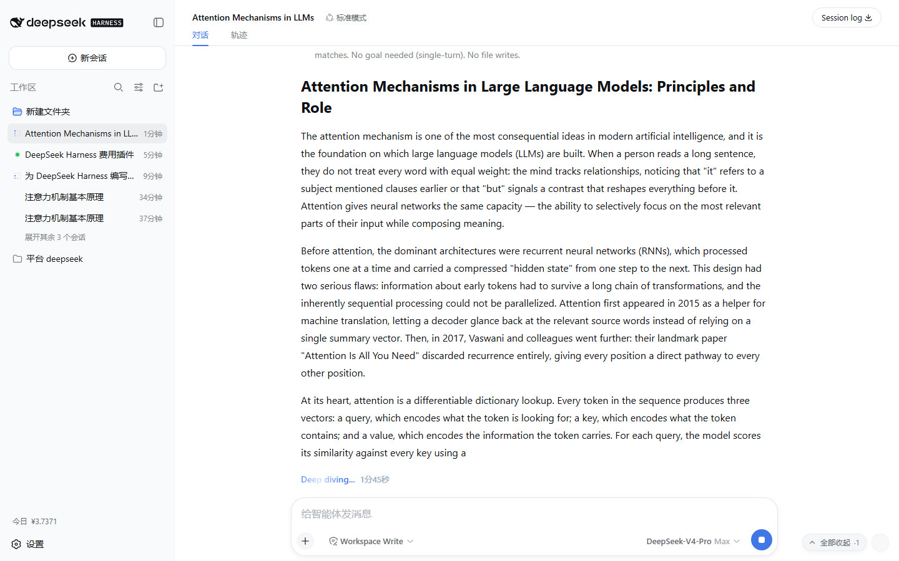
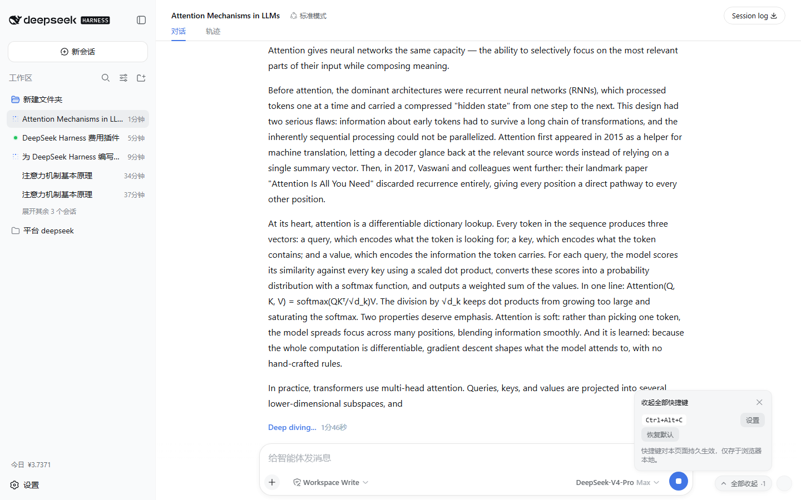
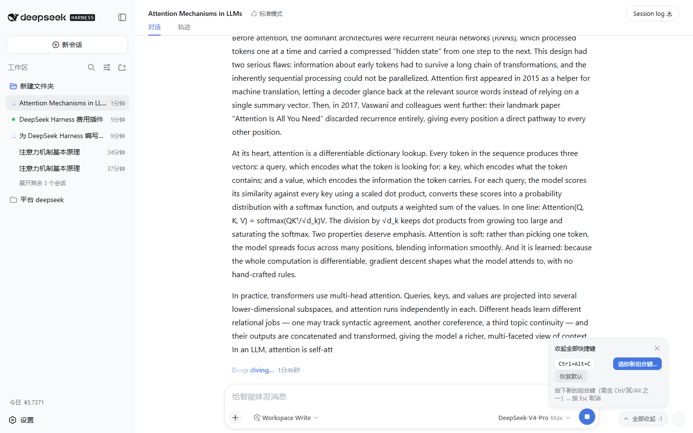
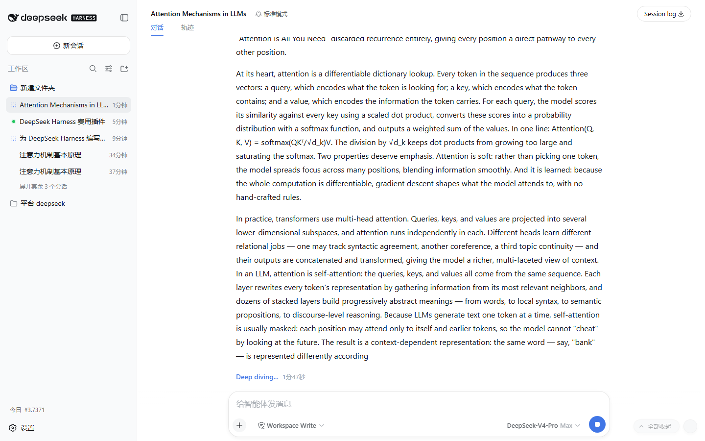

# dsh-sticky-disclosure

[](LICENSE)
[](https://github.com/Han-1413141/dsh-sticky-disclosure/actions/workflows/test.yml)
[](https://awesome-dsh-plugin.com)
English | [中文](README.md)



A DeepSeek Harness (DSH) Desktop and Web plugin: **collapse expanded conversation sections in one click**, including Think, tool cards and turn-process groups. A persistent button shows the expanded count, and the shortcut is customizable. Off-screen headers remain accessible as pinned buttons.



## Recent improvements

- Supports the turn-process buttons in DSH 0.2.0-rc.2 alongside Think and tool cards.
- Chinese/English UI and the correct `⌘⌥C` default on macOS.
- Closing settings or switching sessions stops shortcut capture; IME composition is ignored.
- Escape dismissal, focus restoration and Desktop `no-drag` surfaces.

## ✨ Features

| Feature | Description |
|---|---|
| 📌 Pin off-screen labels | Expanded Think / tool / command labels that slide off the top get pinned as chips; click a chip to collapse the original section |
| 🔘 Collapse-all pill | Always-visible pill at the bottom-right of the chat with a live count (`·N` = expanded sections); one click collapses them all |
| ⌨️ Customizable hotkey | Default `Ctrl+Alt+C` (macOS `⌘⌥C`); press the gear, press a new combo, done — persisted locally |
| 🎨 Native look | Styled entirely with the app's `--dsw-*` design tokens; follows dark/light themes |
| 🪶 Non-invasive | Pure DOM implementation — no app code touched; full cleanup on unload |

### Real screenshots (live DSH Web instance)

**Expanded Think row + the collapse-all pill with its live count**:



**Hotkey settings popover (gear → set → press the new combo)**:

　

**After one click — the count drops to zero**:



## Why

Long conversations accumulate expanded Think rows and tool cards, and collapsing them means hunting down each header one by one — often after it has already scrolled out of view. This plugin puts a permanent "collapse all" pill at the bottom-right of the chat — with a live count of how many sections are expanded — plus a customizable hotkey: **one click or one keystroke returns the conversation to its clean, collapsed view**. When a section scrolls off the top, its header is pinned at the top of the conversation so you never lose the collapse control.

## Behavior

- **Off-screen pinning**: once an expanded header fully slides past the top edge of the conversation scrollport, a chip appears at the top labelled with the section title (`Think`, tool name, …); clicking the chip collapses the original section, and the chip disappears when the header scrolls back into view or the section is collapsed.
- The **collapse-all pill** sits at the bottom-right of the conversation scrollport with a live count (`·N`); clicking it collapses **every** expanded disclosure in the conversation.
- The **hotkey** (default `Ctrl+Alt+C`, macOS `⌘⌥C`) does the same thing, so pressing it always has an immediately observable effect.
- Expand/collapse state, streaming output, and session switches are tracked via `MutationObserver` + scroll/resize listening so the count stays accurate; plugin disposal (HMR/stop) restores everything.
- On apply, the plugin logs `console.info("[dsh-sticky-disclosure] applied …")` and exposes `window.dshStickyDisclosure` (`expanded()` / `hotkey()` / `setHotkey(spec)`).

## ⌨️ Custom hotkey

1. Click the **keyboard gear** next to the collapse-all pill to open the settings popover;
2. Click **Set** — the popover enters capture mode;
3. **Press the new combo** (it must include `Ctrl` / `⌘` / `Alt`, e.g. `Ctrl+Shift+K`) — applied immediately and persisted in the browser's `localStorage` (nothing leaves your machine);
4. `Esc` cancels capture; **Reset default** restores `Ctrl+Alt+C`.

Programmatic access:

```js
window.dshStickyDisclosure.setHotkey({ ctrl: true, shift: true, code: "KeyK" }) // Ctrl+Shift+K
window.dshStickyDisclosure.hotkey()                                              // "Ctrl+Shift+K"
```

### Hotkey design

- Deliberately **not Escape**: the app's dialogs and popups already own `Escape` (the plugin only uses Esc to cancel its own capture, which never interferes);
- it **works while an input is focused** — the most common state, since focus usually stays in the composer;
- it backs off during IME composition (`isComposing`);
- it backs off on AltGr (`getModifierState("AltGraph")` — on some keyboard layouts AltGr is reported as Ctrl+Alt and must never intercept the characters it types).

### Stacking

- The collapse-all pill and the gear are fixed to the scrollport's bottom-right corner.
- `z-index: 15` (popover: 16): above chat content, below the app's overlay layer (20) and all dialogs/popups (100/1000-tier) — it never covers permission prompts, settings panels, or onboarding masks.
- Everything uses the app's design tokens (`--dsw-*`: background, border, shadow, type), so it follows dark/light themes and fonts automatically, with an entrance animation that respects `prefers-reduced-motion`.

## Install

**Desktop (DSH 0.2.0-rc.2):** open **Plugins → Add plugin** in the sidebar, paste the following source, install it, then choose **Enable now**. Follow DSH's restart prompt if shown.

```text
github:Han-1413141/dsh-sticky-disclosure
```

Desktop includes Node and pnpm. For terminal installation, first install the bundled command through **Manage dsh command** in the application menu. Open Desktop once to initialize its profile, fully quit it, and run:

```bash
dsh plugin --profile desktop add github:Han-1413141/dsh-sticky-disclosure
```

Then reopen Desktop. **Web** uses a separate profile:

```bash
dsh plugin --profile web add github:Han-1413141/dsh-sticky-disclosure
dsh web
```

The standalone CLI follows DSH's Node requirement: `^22.19.0 || >=24.0.0` for the version checked here. Desktop's bundled command needs no separate Node or pnpm installation.

PowerShell installer (automatically selects `desktop` for the bundled command, otherwise `web`):

```powershell
irm https://raw.githubusercontent.com/Han-1413141/dsh-sticky-disclosure/main/install.ps1 | iex
```

To select a profile explicitly, download `install.ps1` and run `./install.ps1 -Profile desktop` or `-Profile web`. Without Git, use `https://github.com/Han-1413141/dsh-sticky-disclosure/archive/refs/heads/main.tar.gz` as the source.

```bash
# Replace desktop with web for a Web installation.
dsh plugin --profile desktop update dsh-sticky-disclosure
dsh plugin --profile desktop remove dsh-sticky-disclosure
```

Layout/shortcut preferences belong to the browser origin: Desktop and Web keep separate preferences. Compatibility details and verification limits are in [COMPATIBILITY.md](docs/COMPATIBILITY.md).

## Tuning

All behavior parameters live in the constants block at the top of `lib/client.js`:

| Constant | Default | Meaning |
|---|---|---|
| `DEFAULT_HOTKEY` | `Ctrl+Alt+C` | Default hotkey (changeable in the settings popover, persisted) |
| `STORAGE_KEY` | `dsh-sticky-disclosure:hotkey` | localStorage key for the persisted hotkey spec |
| `DOCK_Z_INDEX` | `15` | Stacking level of the pill/gear (must stay below the app overlay layer at z-20) |
| `PANEL_Z_INDEX` | `16` | Settings popover level (above the pill, below app overlays) |
| `CONTROL_INSET` | `16` | Inset of the collapse-all pill from the scrollport's bottom-right corner |

## Tests

```bash
python -X utf8 test/verify.py
python -X utf8 test/verify_compat.py   # needs Python 3 + playwright (python -m playwright install chromium)
```

`test/` contains:

- `mock.html` — a static harness reproducing the DSH DOM contract (`DisclosureRow` structure + the `[data-conversation-scroll]` scrollport);
- `verify.py` — a Playwright verification script ;
- `capture.py` — a script that captures the demo screenshots/GIF against a live instance.

Coverage: pill presence and count, one-click collapse-all (visible sections and input-focused scenarios), **custom hotkey** (settings popover, capture, Esc cancel, persistence across reload, reset to default, invalid-spec rejection), automatic state sync, composer exclusion, and full disposal.

> CI (`.github/workflows/test.yml`) runs the same suite on every push.

## Limitations

- Scoped to the **conversation flow** (inside `[data-conversation-scroll]`). The Trajectory view has its own collapse controls and is out of scope.
- It works through the `data-open` / `data-disclosure-row` DOM contract. If the upstream app changes that internal structure across upgrades, the selectors need to follow — see `docs/ARCHITECTURE.md`.

## Repository layout

```
dsh-sticky-disclosure/
├── .github/workflows/
│   ├── test.yml                 # CI: Playwright verification suite
│   └── install-smoke.yml        # CI: one-click install smoke test (Windows + Linux)
├── install.ps1                  # one-click install/update script (irm … | iex)
├── package.json                 # dsh.client (platform: web) + dsh.bundle declaration
├── cordis.patch.yml             # host-tree entry row (bundle patch)
├── lib/
│   ├── index.js                 # host half: inert marker plugin (no behavior)
│   └── client.js                # browser half: self-contained bundle (__ModuleLoader__ handoff)
├── test/
│   ├── mock.html                # static harness reproducing the DSH DOM contract
│   ├── verify.py                # Playwright verification script
│   └── capture.py               # demo asset capture script
├── docs/
│   ├── assets/                  # screenshots and GIF
│   └── ARCHITECTURE.md          # architecture and implementation details
├── README.md / README.en.md
└── LICENSE
```

## How it works

- Host side: `dsh-client-modules` scans Loader entries whose manifest declares `dsh.client.platform === "web"`, serves the built `exports["./client"]` artifact at `plugins/??<id>/client.js&rev=<rev>`, and injects the `window.__DSH_BOOT__` entry graph.
- Browser side: the bundle registers a module via `window.__ModuleLoader__.load({ id, factory })`, exports a cordis plugin (`name`/`apply`), and the Web shell's Loader activates it.
- The plugin body is pure DOM: it touches no app code — it reads the `data-open` / `data-disclosure-row` contract and dispatches clicks at the original headers, preserving app-owned state; upstream DOM changes still require adaptation.

See [docs/ARCHITECTURE.md](docs/ARCHITECTURE.md) for the full pipeline, contracts, state model, hotkey configuration, and stacking design.

## License

[MIT](LICENSE)
