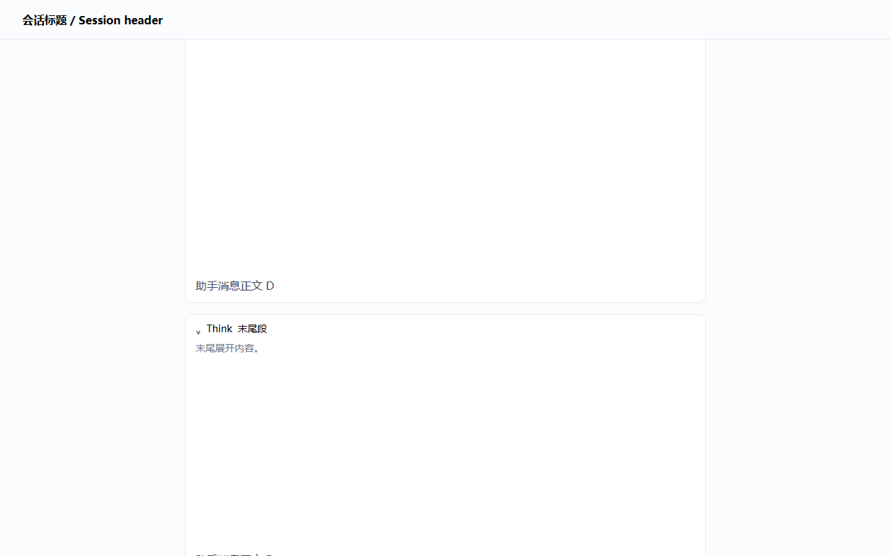

# dsh-sticky-disclosure

[](LICENSE)
[](https://github.com/Han-1413141/dsh-sticky-disclosure/actions/workflows/test.yml)
[English](README.en.md) | 中文

DSH Web 客户端插件：**展开中的可折叠标签（Think 思考行、工具卡片、命令卡片、上下文注入行等所有 DisclosureRow）在滑出聊天视口顶部之后，会把标题“钉”在视口顶部**，让你随时可以收起它；并提供**一键全部收起**的快捷键。



## 为什么需要它

Think 思考行、工具卡片等区块的收起按钮就是它的标题行。当区块展开且内容很长时，往下读会把它顶出屏幕——此时唯一的收起控件在屏幕外，只能一路滚回去点。本插件在标题滑出视口顶部的瞬间，在视口顶部生成一枚浮动的 **affix chip**，把「收起」留在你眼前；区块收起或滚回可见时 chip 自动消失，不留痕迹。

## 行为

- 聊天流里的每个可折叠区块（`data-open` 根节点下的 `[data-disclosure-row]` 标题行）在**展开**状态下，一旦整行标题滑出会话滚动区（`[data-conversation-scroll]`）的上边缘，就会在滚动区顶部出现一枚 affix chip（小药丸按钮），显示该区块的标题（如 `Think`、工具名）。
- **点击 chip = 收起原区块**：对原标题行派发真实 `click`，走应用自己的 React 状态，行为与点击原标题行完全一致；收起后 chip 立即消失。
- 把标题**滚回可视区域**时 chip 自动消失（内容保持展开）。
- 多个滑出的区块按**文档顺序**排成一行（超宽自动换行），互不遮挡。
- **快捷键 `Ctrl+Alt+C`（macOS `⌘+Option+C`）**：一次性收起当前所有已滑出屏幕的展开区块。
- 流式输出、切换会话、展开/收起状态变化都由 `MutationObserver` + 滚动监听自动同步；插件卸载（HMR / 停用）时全部还原。

### 遮挡关系

- dock 固定在会话滚动区的顶部边缘，水平对齐聊天内容的 32px 内边距。
- `z-index: 15`：高于聊天内容（0–6），低于应用浮层（20）与所有弹窗/对话框（100/1000 级），因此**不会盖住权限弹窗、设置面板或欢迎遮罩**。
- chip 全部使用应用设计令牌（`--dsw-*` 系列：背景、边框、阴影、字号），自动跟随深色/浅色主题与字体；带入场动画并尊重 `prefers-reduced-motion`。

### 快捷键设计

刻意**不用 Escape**：应用的对话框与 popup 已占用 `Escape`。`Ctrl+Alt+C` 不与应用任何快捷键冲突，并且：

- **在输入框聚焦时同样生效**——这是最常见的状态（焦点往往留在输入框）；
- 避开 IME 组合输入（`isComposing`）；
- 避开 AltGr 组合（`getModifierState("AltGraph")`——某些键盘布局里 AltGr 会以 Ctrl+Alt 上报，绝不能拦截它输入的字符）。

## 安装

> 需求：DeepSeek Harness（dsh CLI）+ Web 前端。插件随 `dsh web` 启动。

### 方式一：`dsh plugin`（需要机器上有 pnpm）

在本仓库**父目录**执行（相对路径会被锚定到调用目录）：

```bash
# 开发调试（符号链接，改 lib/client.js 后重启 dsh web 即生效）：
dsh plugin --profile web add link:./dsh-sticky-disclosure
# 或固定安装：
# dsh plugin --profile web add file:./dsh-sticky-disclosure
```

### 方式二：手工安装（机器上没有 pnpm）

1. 在 `<DSH_HOME>\profiles\web\package.json`（默认 `%USERPROFILE%\.dsh\profiles\web\package.json`）中：
   - `dependencies` 增加 `"dsh-sticky-disclosure": "link:<本仓库的绝对路径>"`
   - `dsh.profile.bundles` 末尾追加 `"dsh-sticky-disclosure"`
2. 在 profile 的 node_modules 里建目录联接（与 pnpm `link:` 依赖留下的链接一致）：
   ```powershell
   New-Item -ItemType Junction `
     -Path "$env:USERPROFILE\.dsh\profiles\web\node_modules\dsh-sticky-disclosure" `
     -Target "<本仓库的绝对路径>"
   ```

### 激活

插件集合变化在**重启时生效**（运行中的服务保持旧图，不受影响）：

```bash
# 停掉当前 dsh web 后重新启动
dsh web
```

验证是否进入插件图（应看到 `id: sticky-disclosure` 与 `name: dsh-sticky-disclosure`）：

```bash
dsh --profile web --dump-config | findstr sticky-disclosure
```

### 卸载

- 方式一：`dsh plugin --profile web remove dsh-sticky-disclosure`
- 方式二：从 `package.json` 的 `dependencies`/`bundles` 删掉对应条目，删除 `profiles\web\node_modules\dsh-sticky-disclosure` 联接

然后重启 `dsh web`。

## 微调

所有行为参数集中在 `lib/client.js` 顶部常量区：

| 常量 | 默认 | 含义 |
|---|---|---|
| `HOTKEY_LABEL` | `Ctrl+Alt+C` | 快捷键（提示文案；实际判定见 `onKeyDown`） |
| `DOCK_INSET_X` | `32` | chip 排与滚动区左右边距（对齐聊天内容 32px 内边距） |
| `DOCK_TOP_GAP` | `8` | chip 排距滚动区顶部的间距 |
| `DOCK_Z_INDEX` | `15` | 遮挡层级（须低于应用浮层 z-20） |
| `CHIP_MAX_WIDTH` | `260` | 单枚 chip 最大宽度（超出省略） |
| `EDGE_TOLERANCE` | `0.5` | 「完全滑出」判定容差（px） |

改快捷键判定：`lib/client.js` 中 `onKeyDown` 的修饰键与 `event.code` 判断。

## 测试

```bash
python test/verify.py   # 需要 Python 3 + playwright（python -m playwright install chromium）
```

`test/` 包含：

- `mock.html` —— 复刻 DSH DOM 契约（`DisclosureRow` 结构 + `[data-conversation-scroll]` 滚动区）的静态测试台；
- `verify.py` —— Playwright 验证脚本（27 项断言）。

覆盖：滑出顶部后出 chip、位置/间距/z-index(15)、文档顺序、点击收起、`Ctrl+Alt+C` 全部收起（含输入框聚焦场景）、滚回可见时 chip 消失（内容保持展开）、composer 内面板永不钉住、卸载全量还原。

> 本仓库的 CI（`.github/workflows/test.yml`）在每次推送时运行同一套脚本。

## 局限

- 只覆盖**会话聊天流**（`[data-conversation-scroll]` 内）。「轨迹（Trajectory）」视图使用自己的滚动容器与折叠控件，不在范围内。
- 只处理「从顶部滑出」的方向（最常见：往下读时区块被顶出屏幕）；从底部滑出不做处理。
- 靠 `data-open` / `data-disclosure-row` DOM 契约工作：若上游应用改变这些契约（属于内部结构，升级时可能变化），需要同步更新选择器。当前契约见 `docs/ARCHITECTURE.md`。

## 目录

```
dsh-sticky-disclosure/
├── .github/workflows/test.yml   # CI：Playwright 验证套件
├── package.json                 # dsh.client(platform: web) + dsh.bundle 声明
├── cordis.patch.yml             # 宿主树入口行（bundle patch）
├── lib/
│   ├── index.js                 # 宿主半身：惰性标记插件（无行为）
│   └── client.js                # 浏览器半身：自包含 bundle（__ModuleLoader__ handoff）
├── test/
│   ├── mock.html                # 复刻 DSH DOM 契约的静态测试台
│   ├── verify.py                # Playwright 验证脚本（27 项断言）
│   └── shot-chips.png           # 效果截图（mock 环境）
├── docs/ARCHITECTURE.md         # 架构与实现细节
├── README.md / README.en.md
└── LICENSE
```

## 原理

- 宿主侧 `dsh-client-modules` 扫描 Loader 条目中声明了 `dsh.client.platform === "web"` 的包，把 `exports["./client"]` 指向的构建产物以 `/plugins/<id>/client.js` 提供给浏览器，并注入 `window.__DSH_BOOT__` 入口图。
- 浏览器侧 bundle 通过 `window.__ModuleLoader__.load({ id, factory })` 注册模块，导出 cordis 插件（`name`/`apply`），由 Web shell 的 Loader 激活。
- 插件本体是纯 DOM 层：不动应用代码，只读 `data-open` / `data-disclosure-row` 契约并向原标题行派发 `click`，因此与应用升级/主题/语言无关。

更多细节（管线、契约、状态模型、遮挡设计）见 [docs/ARCHITECTURE.md](docs/ARCHITECTURE.md)。

## License

[MIT](LICENSE)
