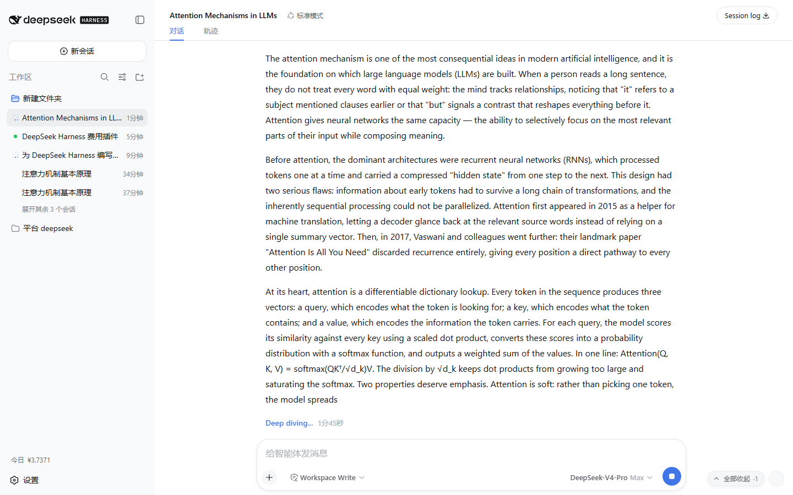

# dsh-sticky-disclosure

[](LICENSE)
[](https://github.com/Han-1413141/dsh-sticky-disclosure/actions/workflows/test.yml)
[English](README.en.md) | 中文

DSH Web 客户端插件：**展开中的可折叠标签（Think 思考行、工具卡片、命令卡片、上下文注入行等所有 DisclosureRow）滑出聊天视口顶部之后，把标题“钉”在视口顶部**，让你随时能收起它；常驻「全部收起」按钮 + **可自定义的快捷键**，一键收起会话里所有展开区块。


## ✨ 功能

| 功能 | 说明 |
|---|---|
| 🧲 Affix chips | 展开区块滑出视口顶部 → 标题自动钉在视口顶部，点击即收起原区块，滚回可见自动消失 |
| 🔘 全部收起按钮 | 聊天区右下角常驻药丸，实时计数（`·N`），一键收起全部展开区块 |
| ⌨️ 自定义快捷键 | 默认 `Ctrl+Alt+C`（macOS `⌘⌥C`），齿轮按钮 → 按下新组合键即改，持久保存 |
| 🎨 原生外观 | 全部使用应用 `--dsw-*` 设计令牌，自动跟随深色/浅色主题 |
| 🪶 无侵入 | 纯 DOM 实现，不动应用代码；卸载即全量还原 |

### 实机截图（真实 DSH Web 实例）

**展开 Think 行 + 常驻按钮**：


**滑出视口后，标题被钉在顶部，随时可收起**：



**快捷键设置面板（齿轮 → 设置 → 按下新组合键）**：

　

## 为什么需要它

Think 思考行、工具卡片等区块的收起按钮就是它的标题行。当区块展开且内容很长时，往下读会把它顶出屏幕——此时唯一的收起控件在屏幕外，只能一路滚回去点。本插件在标题滑出视口顶部的瞬间，在视口顶部生成一枚浮动的 **affix chip**，把「收起」留在你眼前；区块收起或滚回可见时 chip 自动消失，不留痕迹。

## 行为细节

- 聊天流里的每个可折叠区块（`data-open` 根节点下的 `[data-disclosure-row]` 标题行）在**展开**状态下，一旦整行标题滑出会话滚动区（`[data-conversation-scroll]`）的上边缘，滚动区顶部就会出现一枚 chip，显示该区块标题（`Think`、工具名……）。
- **点击 chip = 收起原区块**：对原标题行派发真实 `click`，走应用自己的 React 状态，与点击原标题行完全一致；收起后 chip 立即消失。
- 标题**滚回可视区域**时 chip 自动消失（内容保持展开）。
- 多个滑出区块按**文档顺序**排成一行（超宽换行），互不遮挡。
- **「全部收起」按钮**常驻滚动区右下角，带实时计数；点击收起**所有**展开区块（可见与不可见一视同仁）。
- 快捷键同样收起**所有**展开区块，按下立刻有可观察效果——这也是判断插件是否存活的快捷方式。
- 插件加载时打一条 `console.info("[dsh-sticky-disclosure] applied …")`，并提供调试句柄 `window.dshStickyDisclosure`（`expanded()` / `affixed()` / `hotkey()` / `setHotkey(spec)`）。
- 流式输出、切换会话、展开/收起状态变化由 `MutationObserver` + 滚动监听自动同步；插件卸载（HMR / 停用）时全部还原。

## ⌨️ 自定义快捷键

1. 点击「全部收起」按钮旁的 **⌨ 齿轮按钮**，打开设置面板；
2. 点击 **「设置」**，面板进入捕获状态；
3. **直接按下新的组合键**（必须含 `Ctrl` / `⌘` / `Alt` 之一，例如 `Ctrl+Shift+K`）——立即生效并持久保存（仅存于浏览器 `localStorage`，不会上传）；
4. 按 `Esc` 取消捕获；点 **「恢复默认」** 回到 `Ctrl+Alt+C`。

也可编程设置：

```js
window.dshStickyDisclosure.setHotkey({ ctrl: true, shift: true, code: "KeyK" }) // Ctrl+Shift+K
window.dshStickyDisclosure.hotkey()                                              // "Ctrl+Shift+K"
```

### 快捷键设计要点

- 刻意**不用 Escape**：应用的对话框与 popup 已占用 `Escape`（插件内部用 Esc 取消捕获，不影响应用）；
- **输入框聚焦时同样生效**（焦点通常留在输入框）；
- 避开 IME 组合输入（`isComposing`）与 AltGr 组合（`getModifierState("AltGraph")`，某些布局里 AltGr 会以 Ctrl+Alt 上报，绝不能拦截它输入的字符）。

### 遮挡关系

- dock 固定在滚动区顶部边缘，对齐聊天内容 32px 内边距；「全部收起」按钮与齿轮固定在右下角。
- `z-index: 15`：高于聊天内容（0–6），低于应用浮层（20）与所有弹窗（100/1000 级）——**不会盖住权限弹窗、设置面板或欢迎遮罩**。
- 全部使用 `--dsw-*` 设计令牌，自动跟随主题与字体；入场动画尊重 `prefers-reduced-motion`。

## 安装

> 需求：DeepSeek Harness（dsh CLI）+ Web 前端。插件随 `dsh web` 启动。

### 方式一：`dsh plugin`（需要机器上有 pnpm）

在本仓库**父目录**执行（相对路径会被锚定到调用目录）：

```bash
# 开发调试（符号链接，改 lib/client.js 后刷新页面即生效）：
dsh plugin --profile web add link:./dsh-sticky-disclosure
# 或固定安装：
# dsh plugin --profile web add file:./dsh-sticky-disclosure
```

### 方式二：手工安装（机器上没有 pnpm）

1. 在 `<DSH_HOME>\profiles\web\package.json`（默认 `%USERPROFILE%\.dsh\profiles\web\package.json`）中：
   - `dependencies` 增加 `"dsh-sticky-disclosure": "link:<本仓库的绝对路径>"`
   - `dsh.profile.bundles` 末尾追加 `"dsh-sticky-disclosure"`
2. 在 profile 的 node_modules 里建目录联接（与 pnpm `link:` 依赖留下的链接一致）：
   ```powershell
   New-Item -ItemType Junction `
     -Path "$env:USERPROFILE\.dsh\profiles\web\node_modules\dsh-sticky-disclosure" `
     -Target "<本仓库的绝对路径>"
   ```

### 激活

插件集合变化在**重启时生效**（运行中的服务保持旧图）。**插件 bundle 按 no-cache 提供**：改完 `lib/client.js` 后只需**刷新页面**（Ctrl+F5）即可拿到新代码，无需重启服务。

```bash
# 首次安装后：停掉当前 dsh web 再启动
dsh web
```

验证是否进入插件图（应看到 `id: sticky-disclosure` 与 `name: dsh-sticky-disclosure`）：

```bash
dsh --profile web --dump-config | findstr sticky-disclosure
```

页面加载后，聊天区右下角出现「全部收起」药丸按钮即表示插件已激活。

### 卸载

- 方式一：`dsh plugin --profile web remove dsh-sticky-disclosure`
- 方式二：从 `package.json` 的 `dependencies`/`bundles` 删掉对应条目，删除 `profiles\web\node_modules\dsh-sticky-disclosure` 联接

然后重启 `dsh web`。

## 微调

所有行为参数集中在 `lib/client.js` 顶部常量区：

| 常量 | 默认 | 含义 |
|---|---|---|
| `DEFAULT_HOTKEY` | `Ctrl+Alt+C` | 默认快捷键（可在设置面板修改并持久化） |
| `STORAGE_KEY` | `dsh-sticky-disclosure:hotkey` | 快捷键持久化的 localStorage 键 |
| `DOCK_INSET_X` | `32` | chip 排与滚动区左右边距（对齐内容 32px 内边距） |
| `DOCK_TOP_GAP` | `8` | chip 排距滚动区顶部的间距 |
| `DOCK_Z_INDEX` | `15` | 遮挡层级（须低于应用浮层 z-20） |
| `PANEL_Z_INDEX` | `16` | 设置面板层级（高于 chips、低于应用浮层） |
| `CHIP_MAX_WIDTH` | `260` | 单枚 chip 最大宽度（超出省略） |
| `CONTROL_INSET` | `16` | 「全部收起」按钮距滚动区右下角的间距 |
| `EDGE_TOLERANCE` | `0.5` | 「完全滑出」判定容差（px） |

## 测试

```bash
python test/verify.py   # 需要 Python 3 + playwright（python -m playwright install chromium）
```

`test/` 包含：

- `mock.html` —— 复刻 DSH DOM 契约（`DisclosureRow` 结构 + `[data-conversation-scroll]` 滚动区）的静态测试台；
- `verify.py` —— Playwright 验证脚本（48 项断言）；
- `capture.py` —— 在真实实例上采集演示截图/GIF 的脚本。

覆盖：常驻按钮与计数、chip 出现/位置/间距/z-index/文档顺序、点击收起、快捷键全部收起（可见区块 + 输入框聚焦）、**自定义快捷键**（设置面板、捕获、Esc 取消、持久化、恢复默认、非法规格拒绝）、滚回自动消失、composer 排除、卸载全量还原。

> 本仓库的 CI（`.github/workflows/test.yml`）在每次推送时运行同一套脚本。

## 局限

- 只覆盖**会话聊天流**（`[data-conversation-scroll]` 内）。「轨迹（Trajectory）」视图使用自己的滚动容器与折叠控件，不在范围内。
- 只处理「从顶部滑出」的方向（最常见：往下读时区块被顶出屏幕）；从底部滑出不做处理。
- 靠 `data-open` / `data-disclosure-row` DOM 契约工作：若上游应用升级改变这些内部结构，需要同步更新选择器。当前契约见 `docs/ARCHITECTURE.md`。

## 目录

```
dsh-sticky-disclosure/
├── .github/workflows/test.yml   # CI：Playwright 验证套件
├── package.json                 # dsh.client(platform: web) + dsh.bundle 声明
├── cordis.patch.yml             # 宿主树入口行（bundle patch）
├── lib/
│   ├── index.js                 # 宿主半身：惰性标记插件（无行为）
│   └── client.js                # 浏览器半身：自包含 bundle（__ModuleLoader__ handoff）
├── test/
│   ├── mock.html                # 复刻 DSH DOM 契约的静态测试台
│   ├── verify.py                # Playwright 验证脚本（48 项断言）
│   └── capture.py               # 演示素材采集脚本
├── docs/
│   ├── assets/                  # 截图与 GIF
│   └── ARCHITECTURE.md          # 架构与实现细节
├── README.md / README.en.md
└── LICENSE
```

## 原理

- 宿主侧 `dsh-client-modules` 扫描 Loader 条目中声明了 `dsh.client.platform === "web"` 的包，把 `exports["./client"]` 指向的构建产物以 `/plugins/<id>/client.js` 提供给浏览器，并注入 `window.__DSH_BOOT__` 入口图。
- 浏览器侧 bundle 通过 `window.__ModuleLoader__.load({ id, factory })` 注册模块，导出 cordis 插件（`name`/`apply`），由 Web shell 的 Loader 激活。
- 插件本体是纯 DOM 层：不动应用代码，只读 `data-open` / `data-disclosure-row` 契约并向原标题行派发 `click`，因此与应用升级/主题/语言无关。

更多细节（管线、契约、状态模型、快捷键配置、遮挡设计）见 [docs/ARCHITECTURE.md](docs/ARCHITECTURE.md)。

## License

[MIT](LICENSE)
