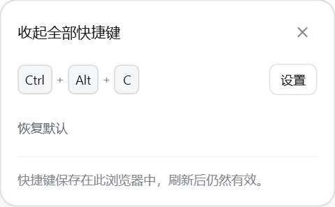
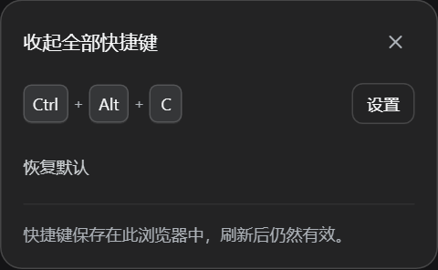

# dsh-sticky-disclosure

[](LICENSE)
[](https://github.com/Han-1413141/dsh-sticky-disclosure/actions/workflows/test.yml)
[](https://awesome-dsh-plugin.com)
[English](README.en.md) | 中文


DSH 桌面端与 Web 插件：**一键收起会话里所有展开的可折叠区块**（Think 思考行、工具卡片、命令卡片、上下文注入行等），带实时计数的常驻按钮 + **可自定义的快捷键**。展开的区块滑出屏幕时，标题会自动钉在会话顶部，随时可以点一下收起。


## 原生风格设置面板

| 浅色主题 | 深色主题 |
|---|---|
|  |  |

使用 DSH 当前主题的背景、字体和圆角，快捷键以独立键帽显示；面板在窄窗口中避开原生标题栏。上图为实际插件在官方主题样式和本地示例页面中的渲染结果。

## 本轮改进

- 识别 DSH 0.2.0-rc.2 的执行过程按钮，同时保留 Think 与工具卡片支持。
- 界面跟随中文或英文设置；macOS 默认快捷键使用 `⌘⌥C`。
- 关闭设置或切换会话时立即停止快捷键捕获，输入法组合输入不被捕获。
- 设置可用 Esc 关闭，关闭后焦点返回设置按钮；桌面端浮层使用 `no-drag`。

## ✨ 功能

| 功能 | 说明 |
|---|---|
| 📌 滑出自动钉住 | 展开的 Think / 工具 / 命令标签滑出会话顶部后，自动在顶部生成 chip，点击即收起原区块 |
| 🔘 全部收起按钮 | 聊天区右下角常驻按钮，实时计数（`·N` = 当前展开的区块数），一键收起全部展开区块 |
| ⌨️ 自定义快捷键 | 默认 `Ctrl+Alt+C`（macOS `⌘⌥C`），齿轮按钮 → 按下新组合键即改，持久保存 |
| 🎨 原生外观 | 全部使用应用 `--dsw-*` 设计令牌，自动跟随深色/浅色主题 |
| 🪶 无侵入 | 纯 DOM 实现，不动应用代码；卸载即全量还原 |

### 交互示例（早期版本的 DSH Web 实机截图）

**展开中的 Think 行 + 右下角带计数的「全部收起」按钮**：


**快捷键设置面板（齿轮 → 设置 → 按下新组合键）**：

　

**一键收起后，计数归零**：


## 为什么需要它

对话一长，展开的 Think 思考行、工具卡片就会攒下一堆——想收起它们得一个个去点标题，而且往下读的时候，标题还会被顶出屏幕。本插件在聊天区右下角放一枚常驻的「全部收起」按钮（实时显示当前展开了几个），再配一个自定义快捷键：**一次点击 / 一次按键，全部收起**。展开区块滑出屏幕时，标题会自动钉在会话顶部，不用滚回去也能随时收起。

## 行为细节

- **滑出自动钉住**：展开区块的标题整行滑出会话滚动区顶部后，顶部会出现一枚 chip，显示该区块标题（`Think`、工具名……）；点击 chip 即收起原区块，滚回可见或收起后 chip 自动消失。
- **「全部收起」按钮**常驻会话滚动区右下角，带实时计数（`·N`）；点击收起会话里**所有**展开的可折叠区块。
- **快捷键**（默认 `Ctrl+Alt+C`，macOS `⌘⌥C`）与按钮等效：一键收起所有展开区块，按下立刻有可观察效果。
- 展开/收起状态、流式输出、切换会话都由 `MutationObserver` + 滚动/尺寸监听自动同步，计数始终准确；插件卸载（HMR / 停用）时全部还原。
- 插件加载时打一条 `console.info("[dsh-sticky-disclosure] applied …")`，并提供调试句柄 `window.dshStickyDisclosure`（`expanded()` / `hotkey()` / `setHotkey(spec)`）。

## ⌨️ 自定义快捷键

1. 点击「全部收起」按钮旁的 **⌨ 齿轮按钮**，打开设置面板；
2. 点击 **「设置」**，面板进入捕获状态；
3. **直接按下新的组合键**（必须含 `Ctrl` / `⌘` / `Alt` 之一，例如 `Ctrl+Shift+K`）——立即生效并持久保存（仅存于浏览器 `localStorage`，不会上传）；
4. 按 `Esc` 取消捕获；点 **「恢复默认」** 回到 `Ctrl+Alt+C`。

也可编程设置：

```js
window.dshStickyDisclosure.setHotkey({ ctrl: true, shift: true, code: "KeyK" }) // Ctrl+Shift+K
window.dshStickyDisclosure.hotkey()                                              // "Ctrl+Shift+K"
```

### 快捷键设计要点

- 刻意**不用 Escape**：应用的对话框与 popup 已占用 `Escape`（插件内部用 Esc 取消捕获，不影响应用）；
- **输入框聚焦时同样生效**（焦点通常留在输入框）；
- 避开 IME 组合输入（`isComposing`）与 AltGr 组合（`getModifierState("AltGraph")`，某些布局里 AltGr 会以 Ctrl+Alt 上报，绝不能拦截它输入的字符）。

### 遮挡关系

- 「全部收起」按钮与齿轮固定在会话滚动区的右下角。
- `z-index: 15`（设置面板 16）：高于聊天内容，低于应用浮层（20）与所有弹窗（100/1000 级）——**不会盖住权限弹窗、设置面板或欢迎遮罩**。
- 全部使用 `--dsw-*` 设计令牌，自动跟随主题与字体；入场动画尊重 `prefers-reduced-motion`。

## 安装

**桌面端（DSH 0.2.0-rc.2）**：在侧栏打开「插件 → 添加插件」，粘贴下面的地址，安装后选择「立即启用」。若应用提示需要重启，按提示操作。

```text
github:Han-1413141/dsh-sticky-disclosure
```

桌面端自带 Node 和 pnpm。使用终端安装时，先从应用菜单的「管理 dsh 命令」安装内置命令；启动过一次桌面端以初始化配置后，完全退出应用，再执行：

```bash
dsh plugin --profile desktop add github:Han-1413141/dsh-sticky-disclosure
```

随后重新打开桌面端。**Web 版**使用独立的 `web` 配置：

```bash
dsh plugin --profile web add github:Han-1413141/dsh-sticky-disclosure
dsh web
```

独立 CLI 遵循 DSH 的 Node 要求，本轮核验版本为 `^22.19.0 || >=24.0.0`；使用桌面端内置命令无需另装 Node 或 pnpm。

PowerShell 一键安装（检测到桌面端内置命令时选择 `desktop`，否则选择 `web`）：

```powershell
irm https://raw.githubusercontent.com/Han-1413141/dsh-sticky-disclosure/main/install.ps1 | iex
```

需要指定目标时，下载 `install.ps1` 后运行 `./install.ps1 -Profile desktop` 或 `-Profile web`。没有 Git 时，可将安装地址换成 `https://github.com/Han-1413141/dsh-sticky-disclosure/archive/refs/heads/main.tar.gz`。

```bash
# Web 版将 desktop 换成 web。
dsh plugin --profile desktop update dsh-sticky-disclosure
dsh plugin --profile desktop remove dsh-sticky-disclosure
```

Web 与桌面端分别保存偏好设置。版本依据与实际验证范围见 [兼容性说明](docs/COMPATIBILITY.md)。

## 微调

所有行为参数集中在 `lib/client.js` 顶部常量区：

| 常量 | 默认 | 含义 |
|---|---|---|
| `DEFAULT_HOTKEY` | `Ctrl+Alt+C` | 默认快捷键（可在设置面板修改并持久化） |
| `STORAGE_KEY` | `dsh-sticky-disclosure:hotkey` | 快捷键持久化的 localStorage 键 |
| `DOCK_Z_INDEX` | `15` | 按钮/齿轮遮挡层级（须低于应用浮层 z-20） |
| `PANEL_Z_INDEX` | `16` | 设置面板层级（高于按钮、低于应用浮层） |
| `CONTROL_INSET` | `16` | 「全部收起」按钮距滚动区右下角的间距 |

## 测试

```bash
python -X utf8 test/verify.py
python -X utf8 test/verify_compat.py   # 需要 Python 3 + playwright（python -m playwright install chromium）
```

`test/` 包含：

- `mock.html` —— 复刻 DSH DOM 契约（`DisclosureRow` 结构 + `[data-conversation-scroll]` 滚动区）的静态测试台；
- `verify.py` —— Playwright 验证脚本；
- `capture.py` —— 在真实实例上采集演示截图/GIF 的脚本。

覆盖：按钮出现与计数、一键收起全部（含可见区块与输入框聚焦场景）、**自定义快捷键**（设置面板、捕获、Esc 取消、持久化、恢复默认、非法规格拒绝）、状态自动同步、composer 排除、卸载全量还原。

> 本仓库的 CI（`.github/workflows/test.yml`）在每次推送时运行同一套脚本。

## 局限

- 只覆盖**会话聊天流**（`[data-conversation-scroll]` 内）。「轨迹（Trajectory）」视图使用自己的折叠控件，不在范围内。
- 靠 `data-open` / `data-disclosure-row` DOM 契约工作：若上游应用升级改变这些内部结构，需要同步更新选择器。当前契约见 `docs/ARCHITECTURE.md`。

## 目录

```
dsh-sticky-disclosure/
├── .github/workflows/
│   ├── test.yml             # CI:Playwright 验证套件
│   └── install-smoke.yml    # CI:一键安装冒烟验证(Windows + Linux)
├── install.ps1              # 一键安装/更新脚本(irm … | iex)
├── package.json             # dsh.client(platform: web) + dsh.bundle 声明
├── cordis.patch.yml         # 宿主树入口行(bundle patch)
├── lib/
│   ├── index.js                 # 宿主半身：惰性标记插件（无行为）
│   └── client.js                # 浏览器半身：自包含 bundle（__ModuleLoader__ handoff）
├── test/
│   ├── mock.html                # 复刻 DSH DOM 契约的静态测试台
│   ├── verify.py                # Playwright 验证脚本
│   └── capture.py               # 演示素材采集脚本
├── docs/
│   ├── assets/                  # 截图与 GIF
│   └── ARCHITECTURE.md          # 架构与实现细节
├── README.md / README.en.md
└── LICENSE
```

## 原理

- 宿主侧 `dsh-client-modules` 扫描 Loader 条目中声明了 `dsh.client.platform === "web"` 的包，把 `exports["./client"]` 指向的构建产物以 `plugins/??<id>/client.js&rev=<rev>` 提供给浏览器，并注入 `window.__DSH_BOOT__` 入口图。
- 浏览器侧 bundle 通过 `window.__ModuleLoader__.load({ id, factory })` 注册模块，导出 cordis 插件（`name`/`apply`），由 Web shell 的 Loader 激活。
- 插件本体是纯 DOM 层：不动应用代码，只读 `data-open` / `data-disclosure-row` 契约并向原标题行派发 `click`，使用应用自己的状态切换逻辑；DOM 改动时仍需适配。

更多细节（管线、契约、状态模型、快捷键配置、遮挡设计）见 [docs/ARCHITECTURE.md](docs/ARCHITECTURE.md)。

## License

[MIT](LICENSE)
